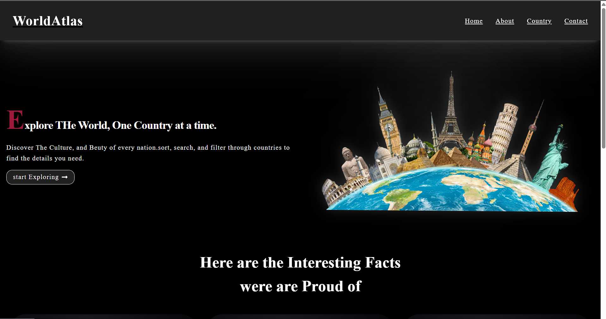
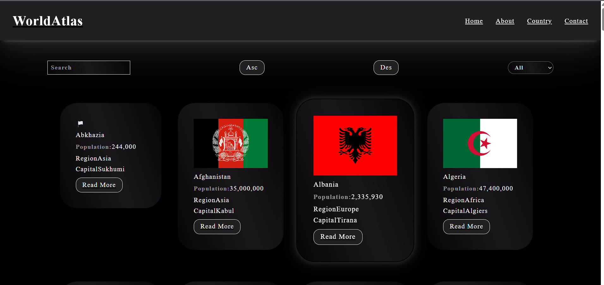
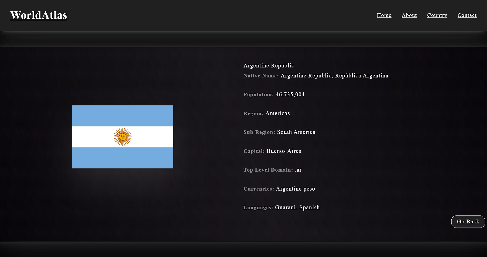
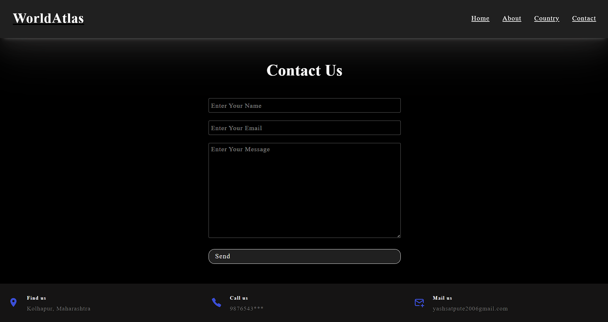

# 🌍 WorldAtlas

A modern React application that allows users to explore countries around the world using live API data. Users can search, filter, sort, and view detailed information about each country through a clean and responsive interface.

---

## 📸 Preview

> Add your project screenshots inside a `screenshots` folder.

### 🏠 Home Page


### 🌎 Countries Page


### 📄 Country Details


### 📞 Contact Page


---

# ✨ Features

- 🌍 Explore countries from around the world
- 📡 Fetch live country data using REST Countries API
- 🔍 Search countries by name
- 🌎 Filter countries by region
- ⬆️ Sort countries in Ascending order
- ⬇️ Sort countries in Descending order
- 📄 View detailed information about each country
- 🚀 Dynamic Routing using React Router
- 📌 URL Parameters using `useParams`
- 📡 API requests using Axios
- ⏳ Loading animation while fetching data
- 📱 Fully Responsive Design
- 🏠 Home Page
- ℹ️ About Page
- 📞 Contact Page
- ⚠️ Custom 404 Error Page
- 🔙 Go Back navigation from details page

---

# 🛠️ Tech Stack

- React.js
- React Router DOM
- Axios
- JavaScript (ES6)
- HTML5
- CSS3
- Vite

---

# 📡 API Used

REST Countries API

The application fetches:

- Country Name
- Flag
- Population
- Capital
- Region
- Sub Region
- Native Name
- Languages
- Currency
- Top Level Domain

---

# 🧠 React Concepts Used

- Functional Components
- React Hooks
  - useState
  - useEffect
  - useTransition
- React Router
- Dynamic Routing
- URL Parameters (`useParams`)
- Conditional Rendering
- Component Reusability
- Axios API Integration
- Loading State Management

---

# 📂 Folder Structure

```text
src/
│
├── api/
├── components/
├── pages/
├── UI/
├── App.jsx
├── main.jsx
└── index.css
```

---

# 🚀 Getting Started

## Clone the repository

```bash
git clone https://github.com/YOUR_USERNAME/WorldAtlas.git
```

## Navigate to project

```bash
cd WorldAtlas
```

## Install dependencies

```bash
npm install
```

## Start development server

```bash
npm run dev
```

---

# 📖 Pages

## 🏠 Home

- Beautiful landing page
- Introduction to the application
- Country facts section

---

## 🌎 Country

- Displays all countries
- Search countries
- Filter by region
- Ascending sorting
- Descending sorting

---

## 📄 Country Details

Displays complete information about a selected country:

- Flag
- Name
- Native Name
- Population
- Region
- Sub Region
- Capital
- Languages
- Currency
- Top Level Domain

---

## ℹ️ About

Provides information about the application.

---

## 📞 Contact

Simple contact form with footer details.

---

## ⚠️ Error Page

Custom 404 page for invalid routes.

---

# 🎯 Future Improvements

- 🌙 Dark / Light Theme
- ❤️ Favorite Countries
- 🗺️ Interactive Maps
- 🌦️ Weather Information
- 📈 Pagination
- ⭐ Compare Countries
- 🎨 Better Animations

---

# 📚 What I Learned

Through this project I improved my understanding of:

- React Router
- Axios
- REST API Integration
- Dynamic Routing
- URL Parameters
- React Hooks
- State Management
- Search & Filter Logic
- Sorting Algorithms
- Responsive UI Design
- Component Reusability

---

# 👨‍💻 Author

**Yash Satpute**

Computer Engineering Student

Passionate about Web Development, IoT, AI/ML, and building real-world projects.

---

# ⭐ Support

If you found this project useful, consider giving it a ⭐ on GitHub!
